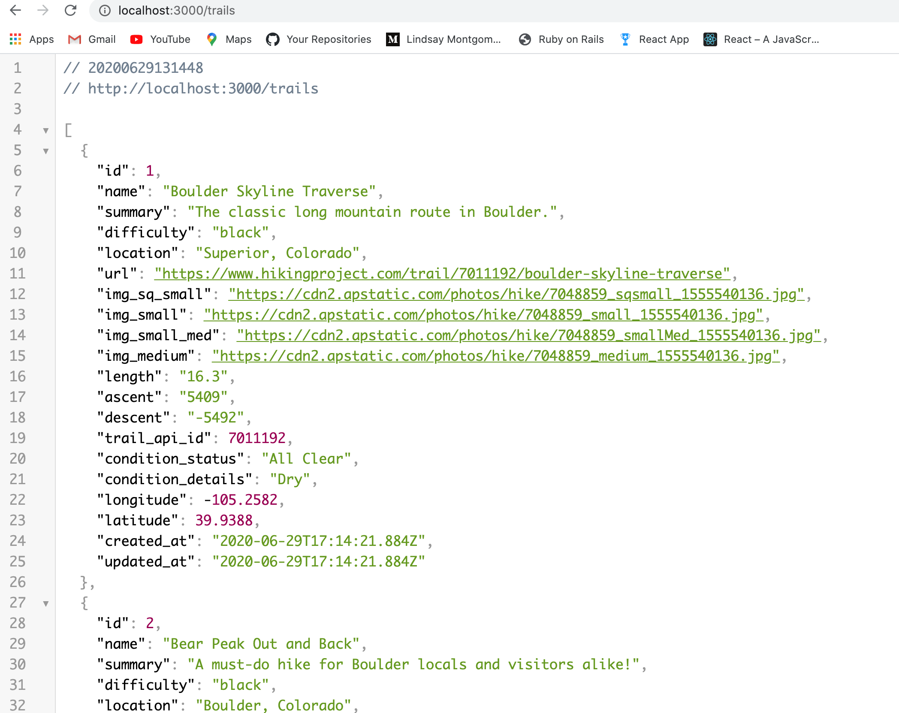

# README

 ## Summary

This is a trail tracking app (similar to an AllTrails Clone). Users can keep track of trails they want to hike and trails they've completed. Users can favorite and unfavorite hikes, and rate hikes they have completed. Users can search trails and review details.  

## Instructions 

1. Clone down this repo and cd into the directory. 

2. Create Your Own Secret Key and get an Hiking Project API Key. This repo relies on the JWT ruby gem to generate user tokens to be stored in localstorage and relies on the Hiking Project A{I to seed the database. Create an application.yml file in the config file. This file should already be added to gitIgnore and will not be pushed to gitHub. Sign up for an API key [here](https://www.hikingproject.com/data)

Your application.yml file should look something like this: 
`hike_api_key= 'YourHikingProjectAPIKey'`
`secret_key= 'YourSecretKeyString'`

3. Run `bundle install`

3. Run `rails db:create`

5. Run `rails db:migrate`

6. Run `rails db:seed`

7. Run `rails s`

8. Rails should be running the api on http://localhost:3000. You can check the trails route going to http://localhost:3000/trails in your browser.

9. Clone down the [getTrails Frontend Repo](https://github.com/marykang09/hikes_frontend) and follow the frontend Readme instructions! 

* Ruby version

* System dependencies

* Configuration

* Database creation

* Database initialization

* How to run the test suite

* Services (job queues, cache servers, search engines, etc.)

* Deployment instructions

* ...
# hikes_backend
